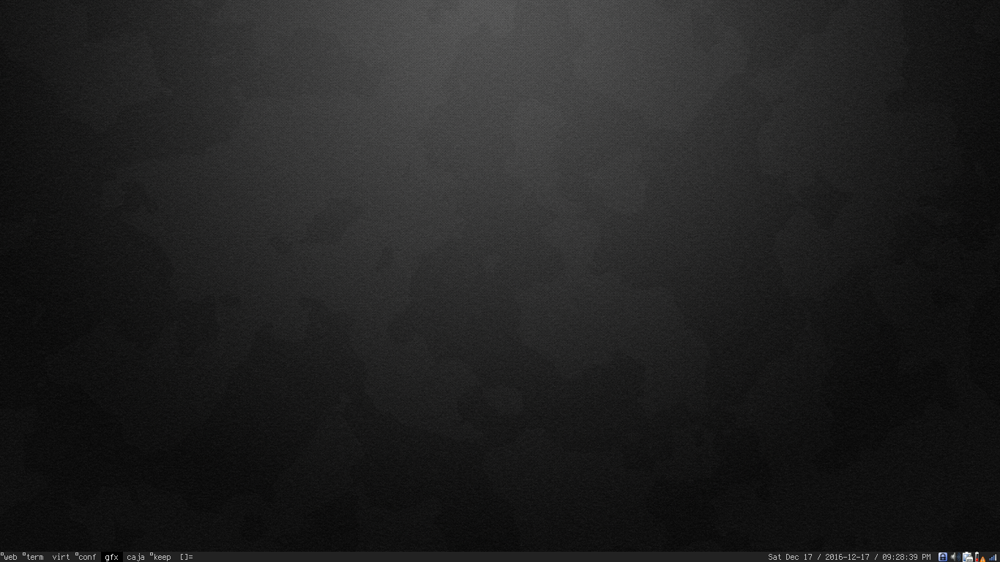

My really simple default linux setup, in just two commands!

### Step 1) Post setup

Run this after a vanilla debian net install. It will grab all the wanted packages.

```su -c "wget https://raw.github.com/mattwind/default/master/post-setup.sh -O /tmp/s; bash /tmp/s `whoami`"```

### Step 2) Customize it

Configure all the neat stuff

```wget -q -O - https://raw.github.com/mattwind/default/master/customize.sh | bash```

### Screenshot


